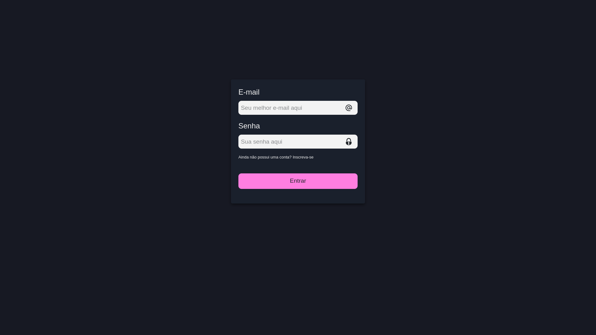
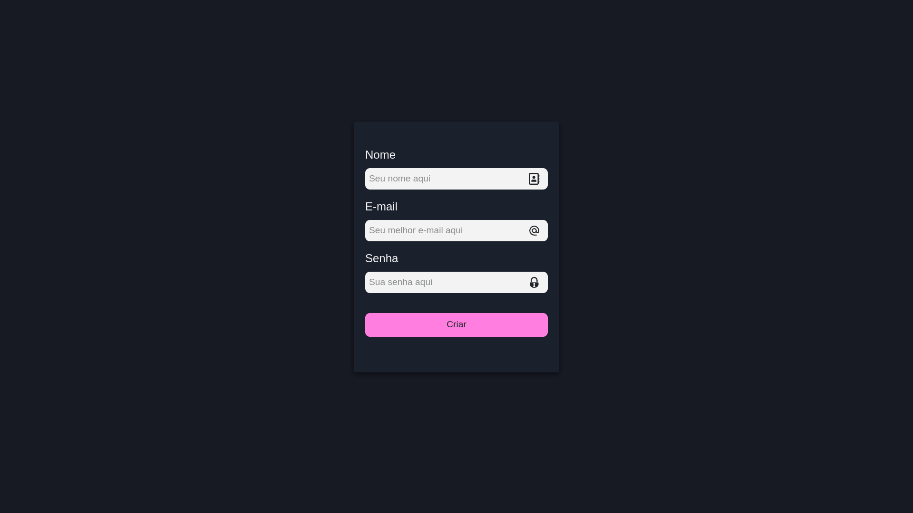
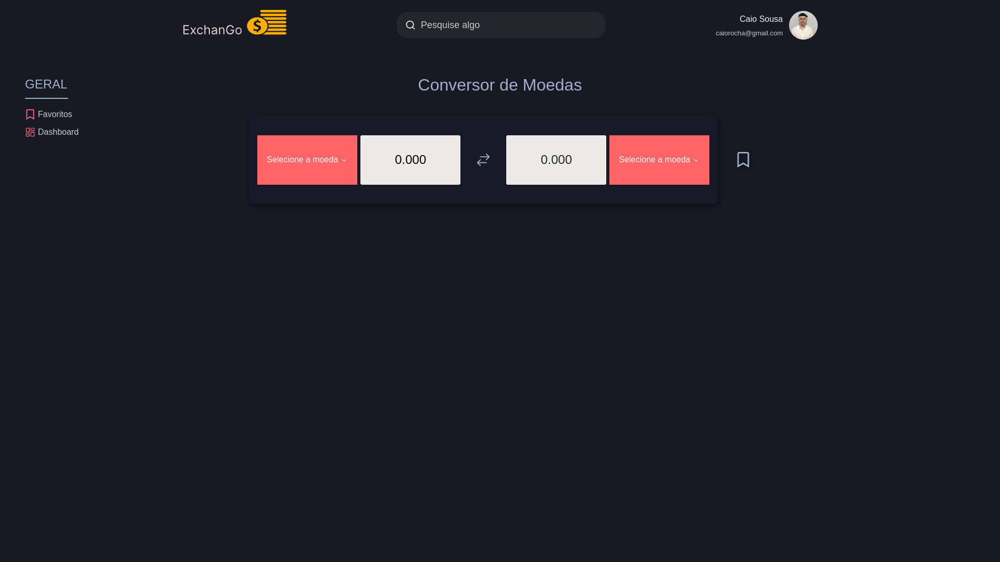
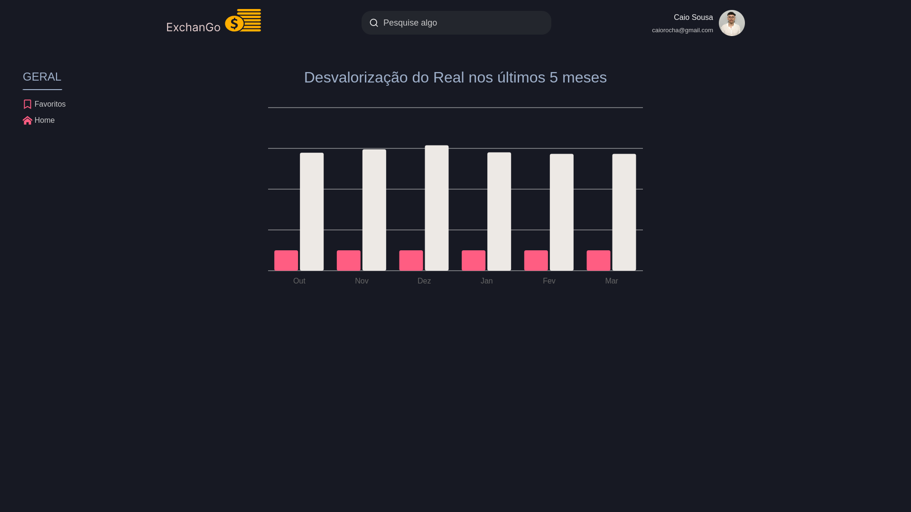
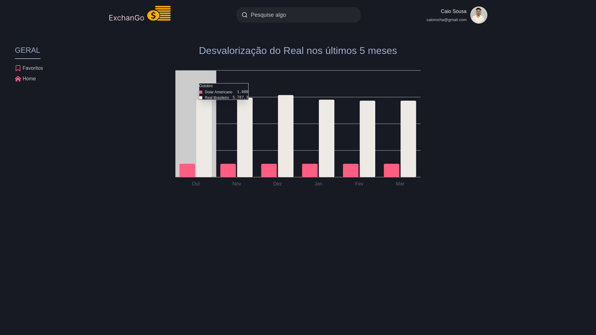

### Currency Exchange

  

  
  
  
  

---

### Descrição Geral

A aplicação em questão é uma plataforma web desenvolvida em React, projetada para fornecer ferramentas de conversão de moedas com base nas taxas de câmbio atualizadas em tempo real. O sistema também oferece recursos personalizados para usuários cadastrados, como configuração de perfil e um dashboard interativo que monitora a desvalorização do Real (BRL) em relação ao Dólar (USD). Além disso, para criar interfaces, animações e interações, utilizei bibliotecas modernas como Chakra UI para componentes, Tippy.js para criar tooltips e o Shadcn UI para criar o gráfico principal. Os dados vêm de APIs públicas, as quais foram acessadas utilizando o Axios.

### Tecnologias usadas

- ReactJS
- Firebase
- Typescript
- Axios
- TailwindCSS
- Tippy.js
- Shadcn UI
- Chakra UI
- Motion

 

### Estrutura da Aplicação

<pre style="overflow-x: auto; max-width: 1000px; white-space: pre;">
/public          # Arquivos estáticos públicos (ex.: ícones, manifest.json, etc.)
/src             # Código-fonte principal da aplicação
  /assets        # Recursos estáticos (imagens, fontes, etc.)
  /components    # Componentes reutilizáveis da aplicação
  /hooks         # Hooks personalizados do React
  /lib           # Bibliotecas ou utilitários globais
  /pages         # Páginas principais da aplicação
  /services      # Serviços (ex.: chamadas de API)
  /styles        # Estilos da aplicação (ex.: .scss)
  /utils         # Funções utilitárias e helpers
  App.tsx        # Componente principal da aplicação
  main.tsx       # Ponto de entrada da aplicação (renderiza o App.tsx)
  routes.tsx     # Definição das rotas da aplicação
  vite-env.d.ts  # Declarações de tipos do Vite
</pre>

### Como usar a aplicação?

 

**Pré-requisitos:**

No momento em que fiz essa aplicação, estou utilizando:

- Tailwind V4
- NodeJS - 22.13.1
- npm - 10.9.3

 

**Instalação:**

- Primeiramente, você deve usar o comando: `https://github.com/CaioSousaa/currency-exchange.git` para clonar o projeto na sua máquina.
- Após isso, rode o comando `npm install` para instalar as dependências e gerar a pasta node_modules

### TELAS

## Login

## Signup

## HOME

## Dashboard

## Tooltip - Dashboard

